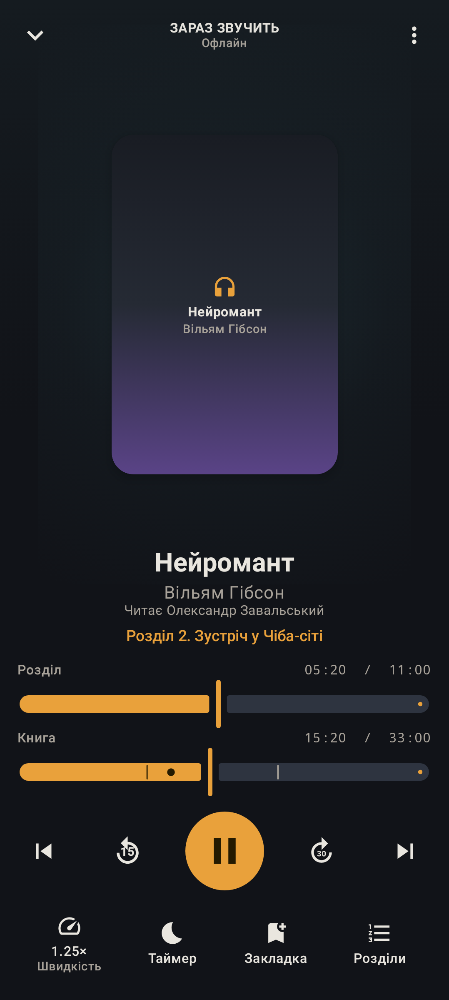
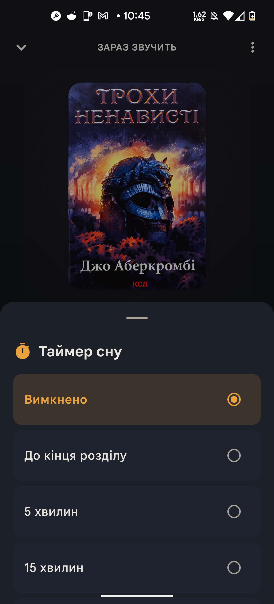
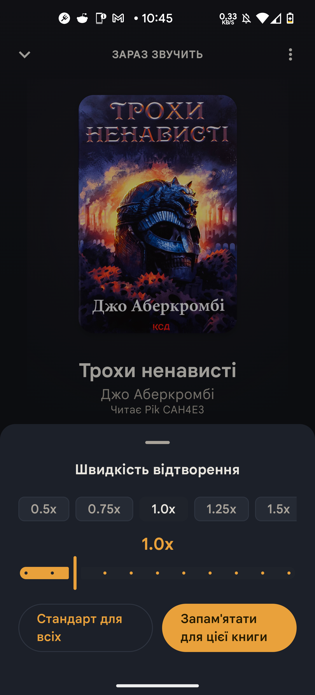

# 🎧 Слухайка — українські аудіокниги. Вільно. Безкоштовно.


[](docs/social-preview.png)

> Всі українські аудіокниги — в одному плеєрі. Без реклами, без підписок,
> без збору даних. Відкрив — і продовжуєш слухати з того місця, де зупинився.

<p align="center">
  <a href="https://github.com/Samuel-Ku/slukhayka/releases"><b>⬇️ Завантажити для Android</b></a>
  &nbsp;·&nbsp;
  <a href="https://github.com/Samuel-Ku/slukhayka">Джерела на GitHub</a>
</p>

<p align="center">
  
  
  
</p>

**Слухайка** — вільний плеєр українських аудіокниг для Android, який ставить
слухача на перше місце. Він збирає книги з шести українських джерел в один
каталог без дублів, працює офлайн і ніколи не перебиває прослуховування
рекламою.

> **Slukhayka** — a free, open-source Ukrainian audiobook player. No ads, no
> subscriptions, no tracking. Android 7+.

## Чому Слухайка

Ми віримо, що аудіокниги мають бути вільними — як і їхні слухачі. Тому
Слухайка працює за простими правилами:

**В Слухайці є** — вся українська бібліотека в одному місці, офлайн-режим,
чесні дані про прослуховування, розумний таймер сну, серії та всесвіти.

**В Слухайці немає** — реклами, підписок, прихованих платежів, збору даних
про тебе та обмежень за часом чи кількістю книг. Завжди.

## Що вміє

- **Уся українська бібліотека в одному місці.** Шість джерел — 4read,
  sound-books.net, audiobook-mp3, lihtar, sluhayua, sluhay — об'єднані в один
  каталог. Одна книга — одна картка, без дублів: не знайшов на одному сайті —
  знайдеш на іншому.
- **Каталог, що росте сам.** Стрічка «Весь каталог» щодня поповнюється
  повзанням сторінок категорій і серій — тисячі книг замість першої сотні,
  і скрол не обривається.
- **Живі добірки з джерел.** «ТОП-100» sound-books та «Популярність»
  sluhayua прилітають прямо в Огляд поруч із «Нобелівськими лауреатами»
  і живим трендом OpenLibrary.
- **Ніколи не пропустиш оновлення.** Коли виходить нова версія Слухайки,
  на Огляді з'являється тихий банер із прямим завантаженням — без Play
  Store і без нав'язливих діалогів; «Приховати» прибирає його до наступного
  релізу.
- **Слухай без інтернету.** Завантажив книгу за пару тапів — і вмикай у
  літаку, метро чи на дачі.
- **Таймер сну, який тебе розуміє.** «До кінця розділу», плавне затихання —
  і струсни телефон, щоб дослухати ще трохи.
- **Твій темп.** Швидкість відтворення 0.5–3.0× із пам'яттю для кожної книги:
  налаштував раз — і більше не думаєш про це.
- **Чесні дані.** Реальні тривалості, кумулятивний прогрес — жодних «00:00»
  замість невідомих значень.
- **Ніколи не загубиш, де зупинився.** Позиція відновлюється з відкатом на
  час паузи, а смарт-перемотка повертає саме туди, куди треба.
- **Серії та всесвіти.** Плеєр знає, що «Метро 2033» — це серія: показує
  продовження, зв'язки між книгами і наступну частину на головній.
- **Рекомендації, які живуть на твоєму телефоні.** «Схоже на Х» — без
  відправки твоїх даних на сервери.
- **Слухай із першого екрана.** Відкрив додаток — одразу продовжуєш слухати:
  перший екран це твій прогрес, а не вітрина магазину.
- **Міні-плеєр завжди поруч** і віджет на головному екрані — контекст
  прослуховування не зникає між екранами.
- **Створено для українців.** Український інтерфейс, темна тема, Material 3.

## Встановлення

1. Відкрий [Releases](https://github.com/Samuel-Ku/slukhayka/releases)
2. Завантаж `slukhayka-v1.2.apk` з останнього релізу
3. Відкрий файл на телефоні — Android один раз попросить дозволити
   встановлення з невідомих джерел; дозволь і готово. ADB не потрібен.

Цілісність файлу можна перевірити за SHA-256 (`slukhayka-v1.2.apk.sha256`),
опублікованим поруч з APK.

> Play Store — у планах. iOS — не планується.

## Збірка з джерел

```bash
git clone https://github.com/Samuel-Ku/slukhayka.git
cd slukhayka
./gradlew :app:assembleDebug
# APK: app/build/outputs/apk/debug/app-debug.apk
```

Release-збірка підписується власним keystore. Локально згенеруй його один раз
і збирай однією командою:

```bash
bash scripts/generate-keystore.sh   # створює my-upload-key.jks + keystore.properties (обидва в .gitignore)
./gradlew :app:assembleRelease      # APK: app/build/outputs/renamed_apks/release/slukhayka-v1.2.apk
```

> ⚠️ Keystore і паролі — єдиний спосіб оновлювати додаток під цим підписом.
> Збережи `keystore.properties` у надійному місці (менеджер паролів, бек-ап).
> У CI підпис налаштований через секрети `KEYSTORE_BASE64`/`STORE_PASSWORD`/
> `KEY_PASSWORD` (див. `.github/workflows/release.yml`).

## Долучайся

Слухайка — відкритий проєкт, і нам важлива кожна пара вух та рук:

- Помилки та ідеї — у [Issues](https://github.com/Samuel-Ku/slukhayka/issues)
  (є шаблон bug report)
- Перед внеском прочитай [CONTRIBUTING.md](CONTRIBUTING.md)
- Структура домену й архітектури — [CONTEXT.md](CONTEXT.md),
  [docs/adr/](docs/adr/) (історія рішень), [docs/specs/](docs/specs/)
  (спеки фіч), навігація по коду — [docs/CODEMAPS/](docs/CODEMAPS/)

## Ліцензія

[GPL-3.0-or-later](LICENSE). Вільне використання, модифікація та
розповсюдження.
