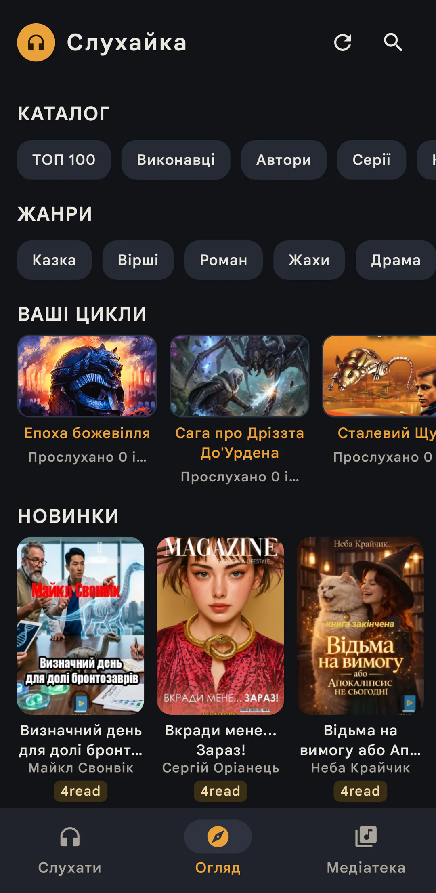
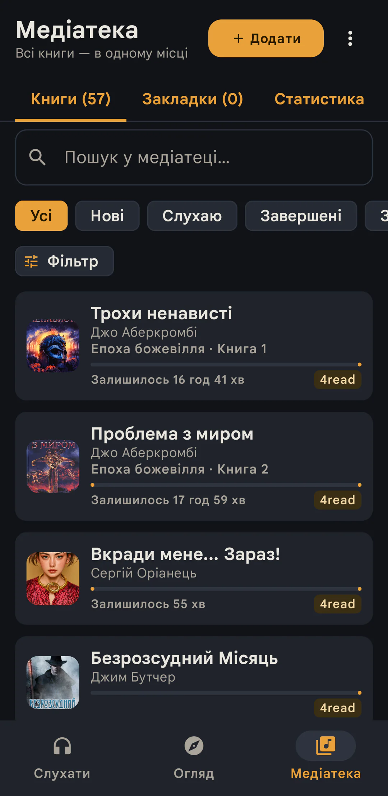
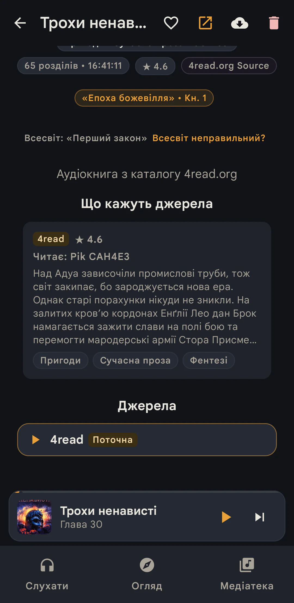
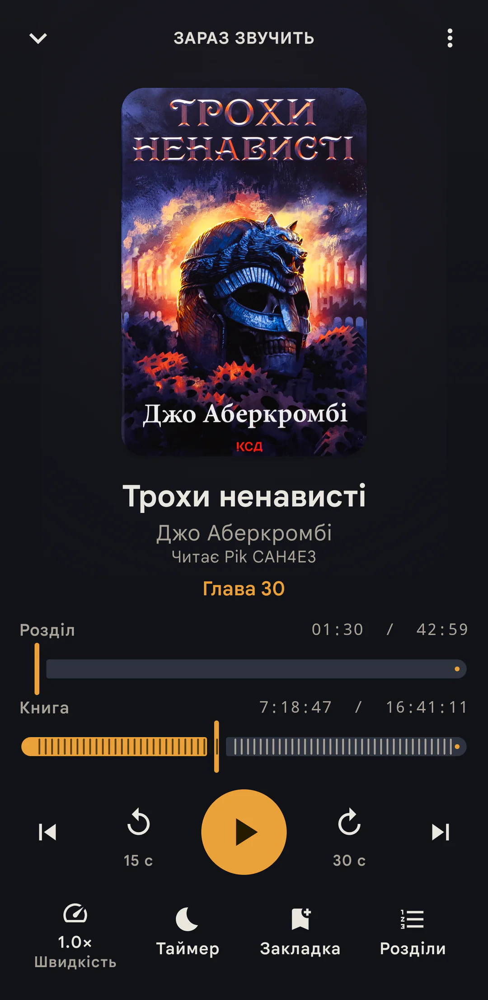

# 🎧 Слухайка — аудіокниги українською


**Слухайка** — безкоштовний застосунок для прослуховування аудіокниг
українською мовою на Android. Я зробив його для себе як цікавий особистий
проєкт: хотів зібрати книги з різних українських сайтів в одному зручному
плеєрі без реклами та підписок.

У програмі вже є всі функції, які я хотів у ній бачити. Якщо вона стане в
пригоді ще комусь — завантажуйте й користуйтеся. Я відкритий до пропозицій і,
ймовірно, покращуватиму Слухайку далі, коли матиму час та натхнення.

<p align="center">
  <a href="https://github.com/Samuel-Ku/slukhayka/releases"><b>⬇️ Завантажити для Android</b></a>
  &nbsp;·&nbsp;
  <a href="https://github.com/Samuel-Ku/slukhayka/issues">Запропонувати ідею або повідомити про помилку</a>
</p>

<p align="center">
  
  
  
</p>
<p align="center">
  
  
</p>

## Що вже реалізовано

- **Єдиний каталог із шести джерел.** Книги з 4read, sound-books.net,
  audiobook-mp3, lihtar, sluhayua та sluhay можна шукати в одному місці.
- **Медіатека й екран «Слухати».** Збережені книги, обране, прогрес і швидке
  продовження прослуховування завжди під рукою.
- **Зручний плеєр.** Пам'ятає позицію, трохи повертає назад після паузи,
  підтримує закладки та керування з віджета.
- **Швидкість і таймер сну.** Темп зберігається окремо для кожної книги, а
  таймер уміє зупинятися наприкінці розділу та плавно стишувати звук.
- **Прослуховування без інтернету.** Книгу можна завантажити на телефон і
  слухати офлайн.
- **Різні начитки й джерела.** Для однієї книги можна бачити доступні варіанти
  озвучення та перемикатися між джерелами без втрати прогресу.
- **Серії, добірки й рекомендації.** Застосунок показує продовження серій,
  тематичні полиці та схожі книги.
- **Оцінки й відгуки.** Книгу можна оцінити, залишити короткий відгук і
  прочитати думки інших слухачів.
- **Оновлення без Play Store.** Коли виходить новий реліз, застосунок показує
  ненав'язливе повідомлення з посиланням на APK.
- **Український інтерфейс.** Є темна тема та додаткові мережеві налаштування,
  зокрема HTTP/SOCKS5-проксі й Tor через Orbot.

## Приватність

У Слухайці немає реклами й аналітики. Медіатека, завантаження та історія
прослуховування зберігаються на телефоні.

Для відгуків програма мовчки створює анонімний профіль без екрана входу й без
особистої електронної адреси. У налаштуваннях можна змінити випадковий нік та
отримати захищений код відновлення профілю.

## Встановлення

1. Відкрийте сторінку [Releases](https://github.com/Samuel-Ku/slukhayka/releases).
2. Завантажте `slukhayka-v1.3.apk` з останнього релізу.
3. Відкрийте файл на телефоні. Android може один раз попросити дозволити
   встановлення з цього джерела.

Цілісність APK можна перевірити за файлом
`slukhayka-v1.3.apk.sha256`, опублікованим поруч.

> Потрібен Android 7 або новіший. Версії для iOS немає.

## Збірка з джерел

```bash
git clone https://github.com/Samuel-Ku/slukhayka.git
cd slukhayka
./gradlew :app:assembleDebug
# APK: app/build/outputs/apk/debug/app-debug.apk
```

Debug-збірка має окрему назву **«Слухайка Debug»** і встановлюється поруч із
релізною версією, не зачіпаючи її дані.

Release-збірка потребує власного keystore:

```bash
bash scripts/generate-keystore.sh
./gradlew :app:assembleRelease
# APK: app/build/outputs/renamed_apks/release/slukhayka-v1.3.apk
```

Keystore і паролі потрібно зберегти в надійному місці: без того самого ключа
Android не дозволить оновити вже встановлену release-версію.

## Пропозиції та внески

Ідеї й повідомлення про помилки можна залишати в
[Issues](https://github.com/Samuel-Ku/slukhayka/issues). Якщо хочете
долучитися кодом, спочатку перегляньте [CONTRIBUTING.md](CONTRIBUTING.md).

Архітектура й терміни проєкту описані в [CONTEXT.md](CONTEXT.md),
[docs/adr/](docs/adr/) та [docs/CODEMAPS/](docs/CODEMAPS/).

## Ліцензія

[GPL-3.0-or-later](LICENSE). Програму можна вільно використовувати,
змінювати та поширювати за умовами ліцензії.
