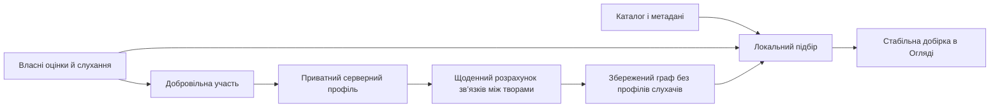

# Персональні рекомендації: наступна цікава книга

Статус: дизайн узгоджено в сесії `/grill-with-docs` 2026-09-05.
Питання 1–11 користувач підтвердив окремо. Для питань 12–35 він доручив
автономно обрати всі рекомендовані варіанти. [Запис інтерв’ю](2026-09-05-personal-recommendations-discovery.md)
зберігає походження рішень. Код, сервер і збір даних за цим дизайном ще
не реалізовані. Числові параметри нижче — обрані початкові налаштування,
які треба перевірити, а не виміряні результати.

## 1. Результат і межі першої версії

Слухач відкриває «Огляд» і знаходить наступну цікаву книгу. Добірка
враховує власний смак, зміст книг і спільні вподобання інших слухачів.
Початковий баланс — вісім близьких до відомого смаку книг і дві для
відкриттів. Ще не розпочаті книги медіатеки також можуть потрапляти сюди.

Перша реалізація — Android: наявний ряд рекомендацій, початкові
вподобання, пояснення, стабільна добірка, добровільний серверний профіль.
Контракт даних передбачає Web Client; перенесення алгоритму та UI у веб
є наступним окремим етапом, а не умовою виходу Android-версії. Наявні
вебкаталог, плеєр і Progress Sync продовжують працювати за своїми правилами.

Плановий масштаб: до 1 000 активних слухачів на місяць, до 10 000
доступних творів, до 100 позитивних творів від одного профілю в одному
обчисленні спільних зв’язків. Це планова місткість, не поточна аудиторія.
Для фінансової моделі беремо 200 активних слухачів на день і перевіряємо
також сценарій із 1 000 на день. Орієнтир нових витрат — до $10 на місяць;
це ціль перевірки кошторису, не гарантований рахунок чи ввімкнений бюджет.

Поточна сесія завершує дизайн і готує послідовність реалізації.
Перепроєктування всього «Огляду», нові джерела аудіо, автоматичне
відтворення наступної рекомендованої книги й генерація текстів через LLM
до першої версії не входять.

## 2. Вибір підходу

| Підхід | Перевага | Обмеження | Рішення |
|---|---|---|---|
| Лише локальний підбір за описами та власним досвідом | Уже є основа, працює без мережі | Не використовує спільний досвід щодо конкретних книг | Залишається базою й резервним варіантом |
| Серверні зв’язки між творами, остаточний підбір на пристрої | Використовує добровільні профілі, дозволяє пояснення й незалежну локальну роботу | Потрібні дані, сервер і перевірка якості зв’язків | Обрано |
| Повний серверний нейронний ранжувальник або пошук найближчих слухачів на кожне відкриття | Більше можливостей для складних моделей | Дорожча підтримка, залежність від сервера й неперевірена користь на малій аудиторії | Відкладено до появи доказів потреби |

Обраний напрям використовує відому ідею item-based collaborative
filtering: спочатку знаходити зв’язки між творами за взаємодіями
слухачів, потім використовувати їх для особистого підбору.
[Первинна робота Sarwar та співавторів](https://ra.ethz.ch/cdstore/www10/papers/519/sdm2.html)
описує цей підхід. Наведені нижче формула, пороги й місце виконання —
наші проєктні рішення; якість на даних «Слухайки» ще не доведена.

Архітектурна межа записана в [ADR-0031](../adr/0031-collective-work-graph-and-local-ranking.md).

## 3. Кандидати й доступність

Кандидати — об’єднання локально відомого каталогу, збережених фідів і
ще не розпочатих творів медіатеки. Підготовка добірки не обходить сайти
й не запускає браузер. Нові метадані надходять через чинні Source Catalog
та колективний канал метаданих, без нового центрального краулера
([ADR-0028](../adr/0028-collective-feed-and-metadata-channel.md)).

Правила застосовуються в такому порядку:

1. Звести озвучення й джерела до одного Work за наявною ідентичністю,
   урахувати перенаправлення після злиття та tombstones.
2. Виключити явно приховані твори й авторів, завершені та вже розпочаті
   твори. Для кількох Editions перевіряти стан кожної; одну книгу не
   можна повернути в нові рекомендації через іншу озвучку.
3. Виключити вибрані на старті улюблені твори з кандидатів: вони
   пояснюють рекомендації, але самі не є новим підбором. Це не ставить
   їм позначку «прослухано» й не змінює Library Entry.
4. Застосувати Content Language Preference на рівні доступних Editions:
   невідома мова залишається видимою. Мова інтерфейсу не фільтрує книги.
5. Серед близьких за підсумковим балом кандидатів, різниця до `0.02`,
   віддати перевагу Edition зі свіжим підтвердженням доступності. Свіжа
   негативна перевірка знижує пріоритет у наступній добірці, але не
   видаляє твір і не означає несхвалення слухача. Невідоме — не помилка.

Порядок Source усередині вибраної Edition, TTL перевірок і сценарій Play
залишаються відповідальністю чинного coordinator за
[ADR-0026](../adr/0026-source-access-order-and-4read-browser-recovery.md).
Фактичний запуск звуку підтверджує Player. Рекомендації не відкривають
браузер як побічний ефект показу чи натискання картки й не підміняють
озвучку. Чинне відновлення після явного Play зберігається.

У десяти рекомендаціях — максимум два твори одного автора, один твір
серії та дві ще не розпочаті книги медіатеки. Останні займають звичайні
персональні місця; на картці видно «У медіатеці». За дефіциту кандидатів
показуємо коротшу добірку. Жорсткі виключення й обмеження повторів не
скасовуємо заради десяти карток. Інші полиці екрана використовують
спільне виключення вже показаних Work, щоб зберегти «одна книга — одна картка».

## 4. Початкові вподобання

На першому вході в «Огляд» новому слухачеві пропонується необов’язковий
крок «Що тобі подобається?». Є пошук по доступному каталогу й добірка
реальних різних книг із відомими обкладинками. Орієнтир — 3–5 книг;
продовжити можна й з однією. Максимум п’ять вибраних книг.

У тому самому кроці можна перейти до жанрів: орієнтир 1–3, максимум
п’ять. Книги та жанри можна поєднувати. Порожній вибір означає пропуск.
Книгу поза відомим каталогом у цій версії не вигадуємо й не шукаємо
окремим зовнішнім сервісом: людина може вказати жанр. Жанровий вибір
піднімає доречні книги, зберігаючи інші жанри доступними.

Вибір зберігається окремо від бібліотеки, Listening State і Listener
Review. У налаштуваннях рекомендацій його можна змінити або очистити.
Повторно автоматично цей крок не відкривається. Після пропуску доступні
загальні добірки з чесними назвами; персональний ряд з’являється,
коли є хоча б один придатний позитивний сигнал або жанрове вподобання.

## 5. Значення сигналів

Оцінюємо Work. Оцінки озвучення, популярність сторінки джерела й оцінки
інших людей не стають особистими оцінками цього слухача. Власний Listener
Review читаємо через чинний модуль; створення початкового вподобання
ніколи не публікує відгук.

Нижче — початкові ваги сигналу одного твору. Спочатку застосовується
явна оцінка; якщо її немає — найсильніший із наявних позитивних сигналів.
Прогрес і завершення одного твору не додаються одне до одного.

| Сигнал | Вага / правило |
|---|---|
| Власні 1 / 2 зірки | `-1.2` / `-0.8`, позитивна поведінка не змінює знак |
| Власні 3 зірки | `0`; прогрес або завершення не перетворюють на схвалення |
| Власні 4 / 5 зірок | `+0.8` / `+1.2` |
| Повторне повне прослуховування без оцінки | `+1.1`, лише за фактичною подією; не звичайне продовження |
| Позначка улюбленого без оцінки | `+1.0` |
| Початкове вподобання твору без оцінки | `+0.7` |
| Завершення без оцінки | `+0.6` |
| Фактичний прогрес від 70% / від 30% | `+0.35` / `+0.2`; максимум один поріг |
| Відкриття картки, короткий старт, пауза, відсутність кліку або повернення | `0` |
| «Цю книгу» / «Цього автора» | Жорстке локальне виключення; не негативна оцінка змісту |
| «Менше схожих» | Окремий локальний негативний напрям `-1.0`, доки слухач не скасує його |

Низька оцінка переважає також позначку улюбленого або початковий вибір.
Скасування оцінки повертає поведінкове правило. «Менше схожих» не змінює
Listener Review: дія залишається видимою в налаштуваннях і скасовується
окремо. Приховування й ці локальні налаштування не синхронізуємо в
першій версії й не використовуємо як спільні оцінки твору.

Прогрес має походити від фактичного слухання: seek, buffering, повторне
надсилання стану або переключення Source не додають часу. Для старих
записів із самою позицією не відновлюємо вигадані хвилини слухання.
Для різних Editions одного Work беремо найсильніше надійне свідчення,
а не суму відсотків. Наявне завершення можна імпортувати як заявлений
факт; це не створює заднім числом успіх рекомендації.

Слабкий прогрес зберігає вагу 30 днів, потім лінійно згасає до нуля
на 180-й день. Явні оцінки, улюблене й початкові вподобання не старіють
самі по собі. Завершення та повторне прослуховування залишаються
локальними фактами; серверні строки наведені в розділі 10. Невідома дата
не підміняється сьогоднішньою. Такий запис не дає переваги свіжості.

## 6. Локальний підбір і пояснення

Заморожений E5 лишається на Android. Жодного донавчання енкодера або
платного виклику LLM на відкриття «Огляду». Пошкоджена модель переходить
на наявний підбір за словами, жанром та автором.

Один `RecommendationCandidateProjection` готує однакові поля для
побудови векторів і ранжування: назва, автор, відомі жанри, серія,
доступний опис із чинним пріоритетом Metadata Override та Assertions,
дата публікації, коли відома. Опис очищається на чинному
`BookRecommendationText`; narrator і URL джерела не входять у Work-текст.
Ключ кешу включає версію енкодера, нормалізації й тексту конкретного
твору. Оновлення опису не повинне залишати старий вектор валідним.

Щоб різні інтереси не зливалися в одну усереднену тему, семантична
відповідність кандидата — максимум зваженої схожості з до 20 найсильніших
позитивних творів. Негативний компонент також окремий максимум.
Ваги нормуються до `[0,1]`, косинус обмежується `[0,1]` для складання бала.

Початкова формула локального бала, після жорстких виключень:

`L = clamp(0.60 × S + 0.20 × G + 0.10 × A + 0.05 × R + 0.05 × F − 0.70 × N, 0, 1)`.

`S` — позитивна семантична відповідність, `N` — негативна; `G`, `A`, `R`
— вподобання жанру, автора, серії. Для цих фасетів також віднімається
негативний внесок, щоб низькі оцінки працювали без E5. `F` — свіжість
відомої дати публікації, лінійно до нуля за 180 днів. Відсутня ознака
не вигадується: її вага перерозподіляється пропорційно між доступними
позитивними компонентами. Якщо жодного особистого доказу немає,
використовується загальна добірка з відповідною назвою.

За наявності надійного спільного зв’язку: `H = 0.70 × L + 0.30 × C`.
Без нього `H = L`; відсутність у графі не штрафує нову або рідкісну книгу.
У пілоті коефіцієнт `C` за замовчуванням нуль, поки не пройдена перевірка
якості. Ці числа є конфігурацією, а не прихованим результатом навчання.

Вісім основних місць вибираються за `H` із обмеженнями різноманіття.
Два місця для відкриттів беруть кандидатів із новим для позитивного
профілю автором або менш представленим жанром та підставою інтересу:
`L ≥ 0.20` або надійний `C ≥ 0.20`. Якщо кандидатів замало, місця
повертаються до звичайного підбору. У короткій добірці резервуємо
`floor(0.2 × N)` місць; фільтри не послаблюємо.

Для відкриттів використовуємо стабільне перемішування придатного пулу
за днем і поколінням ручного оновлення. Показ у попередній добірці
може віддати місце іншому кандидату з близьким балом, але не стає
негативним сигналом смаку.

Пояснення лише шаблонні й підкріплені використаним сигналом:
«Схоже на “X”», «За твоїм інтересом до детективів» або
«Подобається слухачам, яким сподобалася “X”». Спільне пояснення
дозволене лише для допустимого ребра графа. Відсоток «наскільки
сподобається» не показуємо без окремої перевірки калібрування.

## 7. Спільний граф творів

Щодня о 03:00 UTC сервер читає лише чинні добровільні профілі. Від
кожного бере до 100 найсильніших позитивних творів: спочатку явні
оцінки та вподобання, далі завершення; за рівності — відома свіжість
і стабільний Work id. Слабкий частковий прогрес не створює ребер у v1.
Оцінки 1–3 не входять до позитивного перетину.

Для творів `i`, `j`: `n_i` і `n_j` — кількість різних профілів із
позитивним сигналом, `n_ij` — позитивний перетин. Одне озвучення,
десять повторних подій і два пристрої одного профілю дають один внесок.

`edge(i,j) = n_ij / sqrt(n_i × n_j) × n_ij / (n_ij + 10)`.

Будуємо граф лише від 50 чинних профілів із щонайменше трьома
позитивними творами кожен. Ребро потребує `n_ij ≥ 10`. Зберігаємо
до 20 найсильніших сусідів на твір. Це початкові пороги надійності й
обмеження розкриття рідкісних зв’язків, не гарантія анонімності або
захист від групи підставних облікових записів.

Клієнт обчислює `C` як середнє ребер до своїх позитивних творів,
зважене їхньою силою. У знаменник входять лише наявні допустимі
ребра; якщо їх немає, `C` відсутній. Профілі інших слухачів і точні
кількості голосів клієнт не отримує.

Артефакт містить версію схеми, версію сигналів, Work-словник, ваги
ребер, час створення й термін чинності. До 2 MiB стисненого payload;
при перевищенні послідовно прибираємо найслабші ребра, зберігаючи
пороги. Маніфест підписаний Ed25519, містить SHA-256, монотонний номер
і `consentGeneration`. Ключ підпису є лише на сервері; клієнт перевіряє
підпис, розмір, кінцевість чисел, унікальність id й контрольну суму.

Одна задача з lease, явним job id і атомарною публікацією. Перед
публікацією повторно перевіряє покоління згод; відкликання під час
обчислення скасовує застарілий результат. Ті самі вхідні дані дають
той самий граф, повтор задачі не створює додаткових внесків.

Граф можуть використовувати й слухачі, які не надсилають власних
даних. Завантажується весь невеликий артефакт, щоб для його читання
не надсилати список особистих початкових книг. Перевірка маніфесту
не частіше разу за 24 години, повне завантаження лише при зміні hash.
Чинність кешованого графа — 72 години; прострочений граф відкидаємо
навіть офлайн, а локальний підбір продовжує працювати.

## 8. Стабільний перегляд

Локальний модуль зберігає `Recommendation Set`: id, впорядковані Work,
пояснення, версії входів, видимий anchor і зсув. Зміна профілю чи графа
може підготувати наступну добірку, але не переставляє відкриту.

Повернення зі сторінки книги або з фону відновлює той самий перегляд.
Відновлення процесу протягом 24 годин також відновлює добірку, якщо
ідентичності ще можна розв’язати. Новий вхід у вкладку після виходу з
неї застосовує свіжі входи; без змін і в той самий день порядок можна
залишити. Ручне оновлення створює нове покоління добірки.

Приховування прибирає всі відповідні картки одразу. Решта зберігає
порядок і видимий anchor; запасний придатний кандидат додається в
кінець. Undo повертає попередній стан і позицію прихованого твору.
Видалений через tombstone або нерозв’язний Work не залишається
клікабельним через старий snapshot. Звичайна помилка відтворення
оновлює доступність для наступної добірки, не перемішує поточну.

У UI залишаємо один ряд «Рекомендовано для вас», пояснення під карткою,
ознаку «У медіатеці» та наявне меню зворотного зв’язку. Інші персональні
полиці в межах цієї версії не додаємо. uk/en, TalkBack, великі шрифти й
відновлення горизонтального прокручування входять у перевірку.

## 9. Дані, згода й власні пристрої

Серверний Recommendation Profile — окремий добровільний запис.
Власник визначається перевіреним Firebase Auth uid. Сервер видає
випадковий `profileId` і тримає відображення uid → profileId в окремій
закритій колекції. Оператор із відповідним доступом може пов’язати
їх: це псевдонімізація, не повна анонімність.

Нова згода має нову версію. Старий `sharedLearningConsent` із дизайну
п’яти ваг не вмикає її. Пропозиція з’являється після першого
кваліфікованого слухання з рекомендацій; на старті достатньо посилання
в налаштуваннях. Після відмови автоматично повторно не запитуємо.

Перед увімкненням показуємо склад даних, мету, строки, можливість
вимкнення й включення попередньої історії. Імпорт старих даних — окремий
видимий перемикач, початково ввімкнений у цьому кроці з реальним числом
доступних записів. За один початковий імпорт — до 200 останніх відомих
творів, із пріоритетом власних оцінок; старішу історію можна додати
наступною явною дією. Невідомі дати лишаються невідомими.

| Дані | Де й навіщо |
|---|---|
| Work id, завершення, власна оцінка 1–5, власне вподобання, повторне завершення | Приватний профіль, підбір і спільні зв’язки |
| Початкові твори й жанри | Локально завжди; копія в приватному профілі після нової згоди |
| Поріг фактичного прогресу 30/70 і день його досягнення | Приватний профіль; слабка локальна адаптація й майбутнє порівняння правил |
| Показана добірка до 10 Work, вибраний Work, версії алгоритму, кваліфікований старт, повернення, завершення, технічна помилка | Окремий короткоживучий запис результату лише в учасників; перевірка якості |
| День події, серверна ревізія, випадковий id операції, версія згоди | Узгодження, строки й усунення повторів |
| Точні позиції, глава, швидкість і bookmarks | Залишаються в Listening State / Progress Sync, не копіюються в рекомендаційний payload |
| Cookies, аудіо, Source URL, пошукові запити, текст відгуків, IP як поле профілю, hardware id, рекламні id | Не входять у контракт рекомендацій |

Зберігаємо стан одного Work, а не нескінченний журнал натискань.
Типовий пакет — до 50 змінених записів, 64 KiB; звичайні зміни
об’єднуються до одного пакета за сеанс і не частіше ніж раз на 15 хвилин.
Початковий імпорт і видалення мають окремі команди. На профіль — до
2 000 Work-записів; при досягненні межі UI чесно повідомляє про не
синхронізовані записи. Локальна історія не скорочується через цей ліміт.

На іншому пристрої рекомендаційні дані читаються або надсилаються лише
після окремого ввімкнення участі на ньому для вже свідомо зв’язаного
профілю. Одне лише ввімкнення Progress Sync не означає цієї згоди.
Учасник отримує власні відомі сигнали без створення Library Entry,
публічного відгуку чи зміни позиції відтворення на іншому пристрої.
Language Preference, локальні приховування й місце прокручування не
стають спільними. Та сама книга на двох пристроях — один внесок профілю.

Усі мутації перевіряють активну згоду, device enrollment, `consentEpoch`,
id операції та очікувану ревізію. Конфлікт повертає актуальний стан;
старий пакет не перезаписує новішу явну оцінку. Для оцінки з Listener
Review сервер бере лише підтверджений власний відгук відповідного uid;
нові локальні оцінки впливають локально відразу й надсилаються після
підтвердження запису. Відгуки людей без згоди не збираються в навчання.

## 10. Вимкнення, видалення й строки

У налаштуваннях є перегляд власного серверного профілю, експорт JSON
і дія «Вимкнути участь і видалити профіль». Вона відразу припиняє
локальне збирання для сервера, очищує чергу й надсилає запит відкликання.
Офлайн UI показує «Видалення на сервері очікує мережі», а не успіх.
Глобальне відкликання вимикає внески всіх пристроїв цього профілю.

Сервер спочатку атомарно змінює epoch і відкликає згоду, потім
видаляє профіль, записи Work, результати й навчальний підсумок.
Після підтвердження відкликання будь-який старий пакет відхиляється;
нова участь потребує нової згоди, нового profileId і нового неповторного
epoch. Пакет прив’язаний до всієї цієї ідентичності, тому видалення
старого контрольного запису не робить старий пакет придатним. Приватні записи
мають бути фізично прибрані з активного сховища протягом 24 годин.
Мінімальний запис відкликання без Work лишається 30 днів для повторів
запиту; після його видалення відсутній акаунт також не приймає внесків.

На відкликанні поточний граф позначається застарілим. Нові завантаження
переходять на локальний підбір до перебудови. Перебудова без видаленого
профілю — протягом 24 годин; невдала перебудова не повертає старий граф.
Вже завантажені копії неможливо стерти з офлайн-пристроїв віддалено;
їхній внесок припиняє діяти не пізніше завершення 72-годинного TTL.

| Категорія | Строк |
|---|---|
| Слабкі поведінкові поля та день прогресу | До 180 днів; далі видалити поле, не створювати негатив |
| Власні оцінки, вподобання й завершення в чинному серверному профілі | Поки участь активна; весь профіль видалити після 365 днів без звернення власника |
| Персональні записи результатів | До 90 днів, коротше при відкликанні |
| Id оброблених операцій | 7 днів; ревізія та epoch додатково захищають від старого запису |
| Кешований граф | До 72 годин, нові завантаження відкликаної версії заборонені |
| Сукупні метрики експерименту без uid, profileId, Work і малих груп | До 12 місяців; індивідуальний внесок після такого агрегування не відновлюється |

Резервне копіювання приватного профілю в окремий архів не додаємо.
Перед запуском треба звірити фактичні backup/PITR та журнали хмарного
проєкту з цими строками; UI описує фактичне зберігання, а не бажане.
Автоматичне завершення строку дає ту саму перебудову графа, що відкликання.
Ці строки — обрана продуктова політика, не висновок про виконання всіх
правових вимог у невідомих юрисдикціях.

Локальне скидання рекомендацій — окрема дія. Воно очищує початкові
вподобання, локальні приховування, кеш добірки та адаптовані налаштування,
зберігаючи Library Entry, Listening State і Listener Review. Базові
сигнали можуть знову утворитися з цих фактів; UI пояснює це. Скидання
не підміняє видалення серверного профілю й не відкликає участь мовчки.

## 11. Сервер, межі модулів і витрати

Для першої реалізації обрано Firestore та Cloud Functions for Firebase
2nd gen у наявному Firebase-проєкті: окремі колекції й функції для
рекомендацій. Бізнес-правила — чистий TypeScript-модуль; Firebase —
транспорт і сховище. Наявний Cloudflare Worker для джерел не отримує
приватні рекомендаційні профілі або ключ адміністратора Firebase.

| Модуль | Відповідальність |
|---|---|
| `RecommendationService` на Android | Зібрати входи, обчислити підбір, тримати добірку й видимі команди |
| `RecommendationCandidateProjection` | Одна форма метаданих для векторів, ранжування й пояснень |
| `RecommendationSignalStore` | Власні нормалізовані сигнали, кваліфіковані події й початкові вподобання |
| Наявні `RecommendationPreferences`, embedder і кеш | Локальний зворотний зв’язок і побудова векторів |
| `RecommendationSync` | Згода, outbox, ревізії, власний профіль, відкликання |
| `CollectiveGraphStore` | Перевірка маніфесту, кеш і строк чинності графа |
| `recommendation-backend` | Приймання власних змін, зведення профілю, граф, видалення й сукупні метрики |

Це запропоновані межі реалізації; нові модулі ще не існують. MainViewModel
залишає композицію й навігацію. Екрани читають потоки та команди глибокого
модуля, як вимагає ADR-0008. Room потребуватиме окремих таблиць для
початкових вподобань, подій/стану вимірювання, outbox і добірки; номер
міграції береться від фактичної бази на початку реалізації.

Приватні колекції закриті для прямих клієнтських read/write. Власні
операції й читання проходять callable API з Auth, App Check, allowlist
полів, лімітами та перевіркою власника на сервері. App Check вмикається
через `enforceAppCheck`, а не припущення про доступні поля Firestore
Rules. [Документація callable](https://firebase.google.com/docs/functions/callable)
і [примусова перевірка App Check](https://firebase.google.com/docs/app-check/cloud-functions)
описують ці механізми.

Серверний Admin SDK обходить Firestore Rules: власника, згоду, epoch,
ревізію й межі payload перевіряє сам API. Права service account
обмежуються потрібним проєктом і сервісами; доступ до персональних даних
перевіряється окремо. [Документація Firestore](https://firebase.google.com/docs/firestore/security/rules-conditions).

Граф зберігається як серверний об’єкт і віддається як однаковий артефакт
для всіх клієнтів. Особистих списків у запитах на нього немає. Задача
працює щодня з 1 одночасним екземпляром, лімітом 10 хвилин і до 2 GiB
пам’яті. Ingress: `minInstances=0`, початково `maxInstances=2`, пакети
обмежені; переповнення повертає retryable-відповідь, не ламає плеєр.
App Check не доводить, що кожен uid — окрема людина: потрібні ліміти
внеску й перевірка аномалій без автоматичного оголошення користувача шахраєм.

Для навчання зберігається до 100 позитивних сигналів у підсумку одного
профілю до 64 KiB. Повне щоденне читання для 1 000 учасників — близько
1 000 підсумків плюс записи згод, а не всі історичні події. Верхня межа
пар перед зведенням: `1 000 × 100 × 99 / 2 = 4 950 000`. Цей обсяг
треба виміряти у навантажувальному тесті. Обробка профілів потокова,
повторне читання лише через контрольований retry.

За 200 активних клієнтів на день, одне повне оновлення графа розміром
2 MiB щодня дає до 11.7 GiB за 30 днів; за 1 000 — до 58.6 GiB.
Це розрахунок верхньої межі трафіку за припущеннями, не виміряний трафік.
Незмінний hash прибирає повне завантаження. До кошторису додати API,
Firestore, Scheduler, зберігання, мережу, збірки й журнали.

Плановий бюджет перевіряється до пілоту за фактичним регіоном і тарифом.
Функції потребують налаштованого платного плану для production deployment;
[Firebase get started](https://firebase.google.com/docs/functions/get-started)
описує підготовку проєкту. Розклад має окрему вартість і пільги
[Cloud Scheduler](https://firebase.google.com/docs/functions/schedule-functions).
Ліміти безкоштовного Firestore спільні з іншими можливостями застосунку;
TTL-видалення має окрему оплату. [Тарифи Firestore](https://firebase.google.com/docs/firestore/pricing).

Ставимо сповіщення на 50/80/100% планового бюджету та ліміти запитів.
Перед пілотом перевіряємо доступність і покриття spend cap для конкретних
сервісів; alerts-only бюджет не є обмежувачем витрат.
[Cloud Billing](https://docs.cloud.google.com/billing/docs/how-to/budgets),
[spend caps](https://docs.cloud.google.com/billing/docs/how-to/budgets-spend-caps).
Не вимикаємо billing цілого спільного проєкту як засіб зупинки рекомендацій:
окремий перемикач зупиняє їхній ingress і batch, локальний підбір залишається.
У цій сесії жодного платного сервісу не активовано.

## 12. Вимірювання якості

Кваліфікований старт — щонайменше 120 секунд фактичного слухання;
для твору з відомою тривалістю менше 240 секунд — половина тривалості.
Seek, тиша через buffering, пауза й повторний callback не рахуються.
Для успішного завершення за один сеанс потрібне підтвердження фактичного
відтворення щонайменше 80% відомої тривалості без подвійного обліку
ділянок. Невідома тривалість не перетворюється на вигаданий відсоток:
успіх тоді підтверджує повернення в інший день.

Атрибуція починається після того, як персональний ряд реально був
видимим: хоча б одна картка на 50% протягом секунди. Прямий вибір картки
та запуск протягом 30 хвилин прив’язуються до `setId`. Запуск через пошук
або загальний каталог не приписується рекомендаціям. Додане в медіатеку
джерело не створює другу атрибуцію того самого Work.

Основний показник — частка виміряних переглядів добірки, що дали хоча б
один Successful Recommendation: кваліфікований старт і кваліфіковане
продовження в інший локальний день протягом семи днів, або фактичне
завершення протягом семи днів. На один профіль вимірюємо перші три
перегляди за локальний день; ліміт обліку не обмежує користування.
Зміна часового поясу сама не створює новий день повернення: різниця
між фактичними сеансами має бути щонайменше шість годин.

Оцінки 1–2 знімають позитивний результат. Когорту звіту дозріваємо
14 днів; до 90-го дня пізні оцінки можуть виправляти ще збережені
персональні результати. Старі зведені звіти позначають дату зрізу;
пізніша оцінка завжди змінює поточний смак, навіть коли історичний
експеримент уже закрито. Незавершене спостереження не означає dislike.

Покази й події вимірюються на сервері лише за новою добровільною згодою.
Висновки пілоту стосуються його учасників; їх не видаємо за поведінку
всіх користувачів. Додатково дивимося час до першого придатного вибору,
частку технічних відмов Play, низьких оцінок, різноманіття та покриття
нових творів. Технічні відмови не видаляються зі знаменника успіху,
але окремо пояснюють втрати, щоб не навчати негативний смак із 403.

### Перевірка до експерименту

У [старому звіті](../recommend/EVAL-REPORT.md) Recall дорівнює `4.1429`
та `1.1429`. `RecommendationEval.evaluate` ділить число влучань лише
на кількість fold, без числа релевантних творів. Це середнє число
влучань, помилково назване Recall, а не доказ якості з Recall у `[0,1]`.
Також поточний набір вважає всі завершені твори позитивними, що суперечить
новому правилу явних оцінок. Старий GO не переноситься на нову систему.

Новий набір має часовий поділ: профіль до моменту рекомендації,
результат після нього. Один Work не потрапляє в обидві частини через
різні Editions або нормалізації id. Майбутні оцінки не входять у профіль.
Recall@10 = знайдені релевантні твори / усі релевантні твори у fold;
NDCG@10 нормується на ідеальну видачу. Порожня релевантна множина
позначається як непридатний fold, а не вигаданий нуль якості.

Порівнюємо просту базу за жанром/автором, виправлений локальний підбір
і гібрид на однакових кандидатах. Публікуємо розмір і походження набору,
частку пропущених метаданих, Recall/NDCG, різноманіття й помилки.
Жодна метрика не може виходити за свою область значень.

### Пілот

Спочатку граф рахується без впливу на UI. Після тестів запускаємо
стабільний розподіл добровільних профілів 50/50: виправлена локальна
база проти гібрида; UI та правила кандидатів однакові. Мінімум для
аналізу — 50 профілів загалом і 200 дозрілих виміряних переглядів на
варіант. Це мінімум для аналізу, не гарантія статистичної потужності.

Кінцевий зріз плануємо наперед на 42-й день: 28 днів набору й 14 днів
дозрівання. Для основної метрики — 95% інтервал різниці через bootstrap
за слухачем. Позитивний висновок не приймається за проміжним підгляданням;
операційні перевірки можуть лише зупинити варіант при шкоді або збоях.
Розгортати гібрид ширше можна за додатної нижньої межі й відсутності
регресії технічних відмов, низьких оцінок і різноманіття. За недостатнього
обсягу або непереконливого результату зберігаємо локальний підбір і
фіксуємо «користь не доведена». Недостатні дані не замінюємо синтетичними
голосами у production.

## 13. Перевірки й послідовність реалізації

Нижче локальні пакети роботи для майбутніх delivery issues. Вони
підготовлені до перенесення у GitHub; у цій сесії issues не публікувалися.
Завершення дизайну не закриває жодного пакета реалізації.

| Пакет | Залежить від | Видимий результат і критерій готовності |
|---|---|---|
| R1. Єдині метадані та чесні сигнали | — | Одна зірка не дає позитивної рекомендації; жанр і опис доходять до векторів; цільові JVM-тести та новий коректний eval-звіт |
| R2. Початкові вподобання | R1 | Вибір книг/жанрів, пропуск, редагування; перша персональна добірка; перевірка на Android-пристрої |
| R3. Добірка й відкладені книги | R1 | Стабільний порядок, повернення на місце, 8+2, квоти, пояснення й Undo; перевірка на пристрої та цільові UI-тести |
| R4. Згода й приватний профіль | R1 | Видимий склад даних, backfill, own-view/export, вимкнення й правдивий pending; емулятор API/rules, двопристрійні конфлікти й видалення |
| R5. Спільний граф | R4 | Обчислення без впливу на UI, підпис/TTL, пороги й відкликання; навантажувальна проба та кошторис |
| R6. Якість і пілот | R3–R5 | Кваліфіковані результати, чесний звіт бази/гібрида, стабільні варіанти й окремий rollback |
| R7. Web Client | R1–R6 | Ті самі доменні правила й протокол, браузерний резервний підбір, власні локальні фільтри; тест контракту на спільних fixtures |

Тести реалізації мають перевіряти поведінку: явна оцінка проти
завершення; seek і повтор callback; дві Editions; нейтральна перерва;
невідомі метадані; жанровий старт; tombstone; коротка добірка; повернення
та Undo; відсутня модель; offline; профіль без згоди; чужий uid;
відкликання під час пакета або batch; повтор операції; протермінований
граф; підпис і розмір; 9/10 учасників ребра; дублікати профілю; помилки
публікації; Recall у `[0,1]`; відсутність витоку майбутніх оцінок у train.

Запускати цільові тести змінених модулів або `scripts/test-changed.sh`.
Повний suite для локальних змін не потрібен. У цій сесії змінено лише
документацію; перевірені її посилання, узгодженість і формат, не поведінка
майбутньої системи.

## 14. Умови переходу від дизайну до запуску

Продуктові й архітектурні вибори закриті цією автономною сесією.
Наступний крок — R1, потім решта пакетів. Перед серверним пілотом
потрібні реалізовані й перевірені Auth/App Check, відкликання, строки,
правдивий текст згоди, інфраструктурний кошторис і вимірювання.
Це критерії готовності майбутнього коду; вони не оголошені виконаними
через наявність документа. Нові billing, deployment і upload у цій
сесії не виконувалися.
